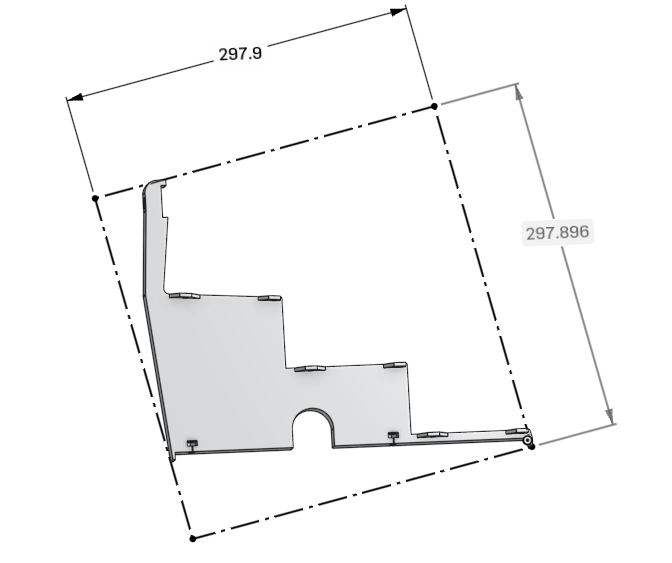
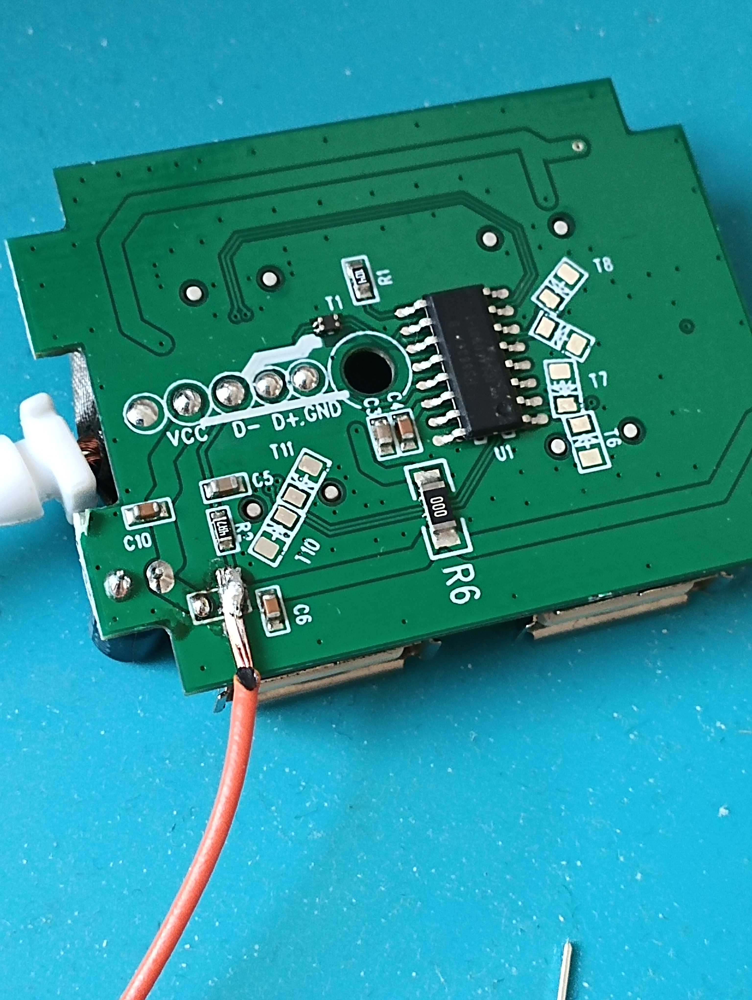
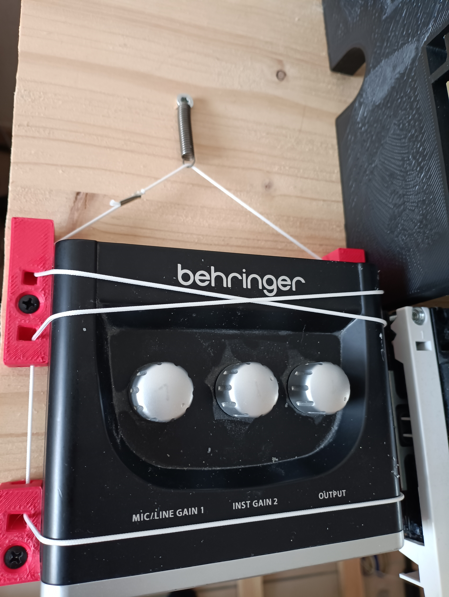

# Necessary tools and alternatives
* Soldering iron with temperature control (required)
* Drill (required)
* 3d printer with a usable print size of at least 298mm x 298mm
    alternative: order printed parts (expensive)
<!-- * Multimeter (recommended) -->
* Plumb bob (recommended, can be easily made yourself if you don't have one)
* some saw that can cut wooden planks
    alternative: order planks with the correct length
* crimping tool for JST XH and Dupont
* computer with a spare m.2 slot (recommended)

# Necessary parts (doesnt' include 3d printed parts)
## Wood
* 4x 24mm x 45mm x 773mm
* 12x 24mm x 45mm x 750mm
* 18x 24mm x 45mm, between 75cm and 76cm long
* 1x 1000mm x 300mm x 18mm
## Screws and nuts
* different M3 / M5 screws
* M5 nuts
* 60 x 3mm x 20mm pins
* M3 heated inserts
* ~100 4mm x 16mm flat head wood screws
* ~50 4mm x 16mm round head wood screws
## electronics and other parts
* at least 10 different colors of ~0.35mm² wire
* 1 sfx psu
* 1 Molex to wire adapter (to get gnd, 12v and 5v from the psu without having to cut cables) you can also order a molex to sata adapter and just cut it apart.
* different dupont compatible female connectors
* 1 usb audio interface
* 1 Millenium KS-4000 or similar keyboard stand. If you buy a different one, it should be at least 800mm in width and some 3d printed parts may need to be adjusted
* 3 WAGO 221-415 (optional)
* 50cm 12V white led strip (optional for pedalboard lighting)
* 1 ASUS Prime N100I-D D4 or comparable mini itx computer. 
* as the n100 doesn't come with ram or an ssd you need those too. Your ram should be at least the size of your sample set + some headroom. The ssd doesn't need to be large, the size of your sample set + 2GB should be sufficient.
* 2 raspberry pi pico
* at least 6 raspberry pi pico H or WH (read further to determine how much you want)
* enough micro usb cables for all raspberry pis. 2 longer ones for the pedalboard, the rest can be pretty short (30cm should be enough)
* 1 3V relay module
* 1 *powered* USB hub (even the computer has enough USB slots) This will be called big hub
* 1 logilink UA0138 or similar 3/4 port urb hub. This will be called small hub
* 3m * 1cm * 2mm felt
* 1 Din rail (EN 60715, 7.5mm) 86cm or 100cm depending on your needs
* 31 [Z-075E-03I springs](https://www.federnshop.com/en/products/extension_springs/z-075e-03i.html) (buy 37 for discount price)
* 60 3mmx16mm steel pins
* ~50cm string (any is fine as long as it isn't too flimsy)
* 30 magnets, round 10mmx3mm N52. A lot of magnets on the intenet are not as advertised so be careful  to get the correct ones.
* 1 12 mm metal rod/pin, around 14cm-16cm long
* 1 12 mm metal rod/pin, around 20cm long
## electronics for soldering
* 21 keyboard switches with 3mm led mounts (for example gateron yellow)
* 1 set of labeled keycaps that allow backlighting. Transparent caps with opaque lettering are preferred over transparent lettering.
* 20 3mm leds
* 4 through hole resistors with a value of (3.3V - Vled)/Iled. Example: your whilte led has a forward voltage of 3V and you want to push 10mA: (3.3V-3V)/0.01A = 30Ω. even if your led is ratet higher, you may not want it to be at peak brightness.
* 1 3mm led as a power on indicator (you may not want this because it just keeps blinking with some mainboards)
* 20 1n4148 though hole diodes
* for each set of 8 registers: 32 fully transparent keyboard switches (for example Akko crystal switch)
* for each set of 8 registers: 1 3x2 2.54mm pin header (not angled)
* enough blank POM keycaps for all keyboard switches
* some 2.54mm jumpers (you won't need more than 10)
* 2 JST XH 8 Pin connectors (board and wire)
* 4 JST XH 5 Pin connectors (board and wire)
* 30 kyocera avx 009176003722106 or equivalent
* 30 TLE49644MXTSA1 sensors

## pcbs
You can order these at sites like jlcpcb / aisler /pcbway though you may neeed to manually select parts if you don't order the assembled pcbs from jlcpcb
* for each set of 8 registers: 1 register pcb (fully assembled top layer excluding switches recommended)
    when ordering assembled pcbs, make sure the parts all have the correct orientation.
    * led + should face right
    * the cathode of the diodes should be facing upwards
    * the dot on the chip should be in the same position as the dot on the pcb.
* 2 stop switch pcbs (not assembled recommended)
* 30 sensor pcbs (assembly only recommended if you are new to soldering) sensor pcbs are small so there is a chance not every manufacturer will make them.

You can download the production files for all pcbs from [here](https://github.com/fuyarovh/organ_kicad/releases)

## smd components (only if you don't order assembled pcbs)
All numbers here are for an individual pcb. Multiply them by the number of register pcbs you want.
* 1 1μF 0603 capacitor
* 0.1 1μF 0603 capacitor
* 32 1n4148W SOD-123
* 32 SMD3014 LEDs with at least 20mA forward current
* 1 IS31FL3236A-QFLS2-TR
* 1 3.9kΩ 0402 resistor
* 3 4.7kΩ 0402 resistors

# Preparing the parts
## 3d printed parts
Print all parts. If a part is needed multiple times, the amount is specified in the part name.
Chose either belt_printer or the 300mm parts, not both.
If the part is prefixed with `s_`, the filament should have a smooth surface to reduce friction.
If the part amount is postfixed with `M`, the part should be mirrorerd before printing.
A `N` in the part amount means nuber of registers / 8. So for 40 Registers `N` would be 5.
Parts with quantity of 0 are optional.
All parts can be printed without support structures.

## wood
You should chose a material that does not or only barely deforms for the planks.
The front_back planks need to have exactly the right length and even more importantly all the same length.
For everything else, dimensions don't need to be exact.
## Swisssonic EasyKey
1. pull of the rotary encoder and the slider caps
1. remove all visible screws from the keyboard, keep the screws from the underside, they'll be needed in a later step
1. remove the case
1. disconnect everything that isn't the keyboard itself from the main board
## Keyboard Stand
Pull off any rubber or similar protection at the top.
## pcbs
if you didn't order the register pcb pre assembled, solder all smd components to it
1. solder the raspberry pis to the register pcbs in the marked location. The usb port should point inwards.
1. solder the 3x2 pin headers to the register pcbs in the marked location. the header should be on the same side as the raspberry pi.
1. solder all components except switches and leds (diodes, resistors, JST headers) to the stop switch pcb
1. solder the hall sensors and the board to wire connectors to the sensor pcbs.
## computer
1. download one of the `organ.img.xz` files from the releases page and extract it (or create it instead with the `create_image.sh` script).
1. write the organ.img to the ssd somehow. On linux use `dd if=organ.img of=/dev/disk/by-id/your-disk-id bs=4M status=progress oflag=sync` On windows either google how to do it or use a tool like clonezilla.
1. install the ssd and ram into the mainboard.
1. download the firmware files from [here](https://github.com/fuyarovh/qmk_firmware/releases) you will need them later

# Assembly
## Assembling the Pedalboard
Use M3 screws and heated inserts to connect the individual front/back plate parts together.
### Inserting the Pedalboard electronics
For each back plate:

1. Solder wires to the ground and row/column pins of a raspberry pi pico. The wires should exit the pi at the bottom and be a bit longer than the backplate itself. Using a different color for each wire is strongly recommended.
The row/column pins are:

|Side\Pin|col0|col1|col2|col3|row0|row1|row2|row3|row4|
|-|-|-|-|-|-|-|-|-|-|
|Left(large)|GP10|GP11|GP12|GP13|GP21|GP20|GP19|GP18|GP17|
|Right(small)|GP10|GP11|GP12|GP13|GP21|GP20|GP19|GP18|-|

2. Screw the raspberry pi to the back plate (weave the wires through the openings at the bottom)
3. Weave the ground wire through all sensor pcbs. keep in mind the orientation of the sensors in the frame while doing this. The ground wire goes in the opening next to the sensor.
4. Weave the other wires through all sensors in a grid-like pattern.
    In practice this means the following (example for the left side)
    | |C|C#|D|D#|E|F|...|
    |-|-|-|-|-|-|-|-|
    | Middle opening on sensor pcb| row0|row0|row0|row0|row1|row1|...|
    |Outer opening on sensor pcb|col0|col1|col2|col3|col0|col1|...|

    Be aware that the raspberry pi is in the middle so for the lower side the sensors nearest to the pi are E, D#, D and so on and not C, C#, ...
    Don't clamp down the cable clamp yet.
5. place the sensors in the correct position one after another starting from the one nearest to the pi. You can use a pipe wrench to clamp down the wire clamp and put the sensor in the correct position. route all other wires above the sensor. If a row is complete, you can cut the row wire after the sensor. You may glue the sensor in place but this should not be necessary.
1. put m3 pins in the holes above the sensors.
1. Flash the firmware to the raspberry pi pico by connecting it to your computer while pressing the button on the pi and then putting the respective firmware files on the pi via the file explorer
1. Test if everything works by plugging the pedal into your computer with a midi monitor program and triggering the sensors by holding a magnet close in the correct orientation. Mark this orientation somehow on a magnet, you'll need it for later.
### Connecting the front and back parts
you can now mount the front_back connectors to the plates by using m3 screws and heated inserts then use 773mm long wood planks to connect the parts.
### Assembling the Pedals
1. put heated inserts in all pedal_back parts
1. insert magnets in the previously marked orientation into the pedal_back  parts. Put a piece of felt (about 2cm long) on top of it to keep it in place. Be careful when handling the magnets as they are strong enough that they will break from smashing against each other.
1. put felt on the underside of the pedal_back parts.
1. screw a spring with an m12 screw to the pedal_back parts. The screw shouldn't be able to go in all the way.
1. For the white keys cut the planks to lengths between 75cm and 76cm. The outer keys are a bit longer than the inner keys. 
For the black keys cut the planks to 75cm.
1. screw the pedal_back pieces to the corresponding wood pieces with round head screws. The most important part is that the top side of the wood is flush against the pedal_back part.
7. for black keys only screw on the black_key parts to the black keys with a round head wood screw and an M3 screw.

### Mounting the Pedals to the Pedalboard
Do for each pedal individually, start from the outside and move to the inside for each side
1. Put the pedal back through the opening  in the frame and mount its spring to the m3 pin.
1. Put a M3 pin through the pedal_front part and insert it into the front of the frame. Don't fix it to the pedal yet.
1. Move the pedal a bit further to the front of the frame than is reasonable and use your hands to clamp it to the pedal_front part.
1. repeatingly press the pedal down while slightly moving it forward until the spring no longer scrapes against the frame.
1. In this position fix the pedal_front part to the pedal with flat head screws

you may need to remove a bit from the high F# pedal in order to make it not bind. This can easily be done with a knife if you don't have proper tools.

### final step
Screw the backplates on.
The 2 separate pedal parts are held together by 2 12mm rods. This allows easy disassembly for transporting.

## Assembling the Top Half
### Assembling the manuals
1. screw on the manual_stands to the manuals from the underside.
The stand without the recess is mounted below the highest keys. One stand is mounted in the next possible position next to the previous stand. One is mounted under the lowest keys and the last below the middle D. Use the screws that came with the keyboards.
1. put this assembly on top of the wooden plate all the way to the right. The manual stand should be flush with the right face of the plate.
1. with a pencil draw the outlines of the stands to the wooden plate. The indents in the stands should be reflected in your outlines.
1. remove the manual assembly from the plate again.
1. extend the markings from the middle stand all the way to the front of the plate. (Doesn't have to be precise)
1. Draw a line across the manual stand markings where the indents are and place hole markers in the middle of those lines.
1. Drill 6mm Holes at those positions.
### Assembling the setter
1. Insert Keyboard switches into the 3d printed parts. The LED should be facing downwards (The shorter mounting brackets). The 3rd position from the left of each part should remain empty
1. Insert the PCB from the back. First insert the lower side and then press down on the upper side.
1. Crimp the following connectors for orientation purposes assume you are looking at the stepper part and therefore the pcb from the back:
    * a: 1 x 7cm JST5 to JST5 long This will be used to connect the left to the right part. The lowest pin on the left should be connected to the lowest pin on the right and so on.
    * b: 2 x 30cm JST8 to 2 DUPONT compatible Pin4 connectors. The 4 pins on the left should go to the same dupont connector in  order, same for the ones on the right. Choose colors in a gradiant from left to right so you can still tell what is left/right on the dupont connector
    * c: x 30cm JST5 to DUPONT 4 pin + DUPONT 2 pin. Color in a gradiant from up to down. The upper 2 wires should go to the same dupont connector. For the lower pins, the lowest 2 are next to each other in the DUPONT 4 pin connector. Skip one and insert the JST middle wire in the last position
    * d: 1 x 10cm DUPONT 3 pin to DUPONT 4 pin. Dupont 3 pin colors are red-black-grey and 4 pin colors are red-blank-grey-black.
1. remove the housing from the small hub.
1. remove bridge at the location seen in the picture and solder 2 10cm wires to it.

1. secure the wires to the hub with some tape.
1. connect the wires to the open (not currently conducting) position of the relay.
1. connecting everything to the pi
    * a to connect the left and right PCB.
    * The 3 Pin of d to the relay (red=power, grey = signal)
    * The 2 Pin of c from up to down to GP16 and GP17
    * The 4 Pin of c from down to up to GP27, GP26, GP22
    * The JST8 of b to the 2 pcbs
    * The left DUPONT of b from the left PCB from left to right to GP9, GP8, GP7, GP6
    * The right DUPONT of b from the left PCB from left to right to GP5, GP4, GP3, GP2
    * The left DUPONT of b from the right PCB from left to right to GP13, GP12, GP11, GP10
    * The right DUPONT of b from the right PCB from left to right to GP18, GP19, GP20, GP21
1. flash the raspberry pi with the setter firmware.
1. Glue the LED strip to the underside of the setter and use the opening to attatch 30cm wires, yellow for + and black for -
1. terminate the yellow wire in a wago (now called 12V wago) and the black wire in another wago (now called ground wago) (wire ferrules recommended)

### Assembling the power button.
1. mount a keyboard switch and optionally an led to the power button board.
1. screw 2 din rail mounting clips to the power button board. the flexible part should be facing downwards, which is the non closed off part.
1. connect solder wires directly to the power button and led and terminate them in female dupont plugs. The length of those wires depends on where you want to put the power button.
1. connect those plugs to power button and optionally power led pins of the mainboard.

### Mounting everything to the board
For this entire section keep the following in mind:
* Stuff can't go where the stands or the manuals go.
* The manuals in the front are really not that high.
* Especially the cables from the PSU are not that bendable so leave enough space to get them through the recesses in the manual stands

1. Mount the PSU mount all the way to the back left and insert the PSU.
1. The mainboard mount is 5cm to the right of the 2nd stand from the right and has ~1cm from the back. The IO of the mainboard should point to the left.
1. cut up a molex to fan adapter and connect the + wire to the 12V wago and the ground wire to the ground wago.
1. connect the fan adapter to the PSU.
1. Install the mainboard and connect it to the PSU.
1. Insert the wires from the Power button as it will be difficult to do it later.
1. Mount the audio Interface as seen in the picture below
    
1. Mount the Setter to the front, the recess should be where the middle manual stand is.
1. put the manuals back on and use M5 screws and nuts to mount them to the board.
1. mount the din rail to the keyboard standoffs using M5 screws and nuts.
1. clip the power button to the din rail

### Assembling the register keyboard
1. connect the boards to a computer and flash the register firmare
1. insert one switch at each edge into the keyboard*plate*.  Make sure that the orientation aligns with the holes in the pcb
1. Solder the plate with the Switches to the board.
1. Insert and solder the rest of the switches. if the Switches don't snap in properly, you can slightly pull on the plate
1. Attach the mounting clips to the plate with M2x8 self tapping screws
1. Add Jumpers to the pin header next to the rasperry pi to set the Id of the keyboard
    In general you want a ids to be ascending numbers starting from 0, as the Id determines which registers are toggled by the Keyboard. Id 0 toggles registers  1-8, Id 1 toggles 9-16 and so on.
    If you assign 2 keyboards to the same Id, they will control the same registers.
    You can use following table to find the jumper configuration for a given Id. 
    x denotes a jumper in the specified position.
    |Id|Position 1| Position 2| Position 3|
    |-|-|-|-|
    |0| | | |
    |1| | |x|
    |2| |x| |
    |3| |x|x|
    |4|x| | |
    |5|x| |x|
    |6|x|x| |
    |7|x|x|x|
1. screw 2 din rail clips to the keyboard. The flexible part should be facing downwards, meaning the direction of the rasperry pi.
1. Clip the register keyboards to the din rail. The ids should increase from left to right.
1. connect the keyboards to the usb hub

## Putting everything together
1. put the keyboard stand where the cutouts on the pedalboard are.
1. put the top half on top of the keyboard stand
1. slide the keyboard stand adapter from the back as far as possible onto the keyboard stand below the top half.
1. align the top half so that the middle D# is directly above the pedal D#. If unsure, the keyboard stand adapter on the right should touch but not overlap the standoff screw.
1. screw the keyboard stand adapters to the top half.
1. put the labeled keycaps on the setter in the following order: ||S|0/O |(F1-F8 or A-H (these are the letter keys)) || ← | → | 1-8 ||
1. put the unlabeled keycaps on the register keyboards. they probably won't all have the same shape, so put the ones that do in the same row.

# How to use 
## First start / calibration mode
1. press S + 0 to enter calibration mode. the first row on the register keyboards should start flashing.
1. press a key on the manual that correcponds to the currently flashing row. the bottom row should belong to the pedalboard and requires 2 presses (one from the left part and one from the right)
## registration
* At the moment each register can be assigned to each manual. Because of this there is currently no plan to implement couplers.
* To activate a register press the button on the keyboards. The row corresponds to the manual/pedal and the column corresponds to the register. A lit button indicates an activated register.
* To save a register combination hold S then press either:
    * a number: This will save the combination to the nuber of the current letter and switch to it
    * a letter followed by a number: This will save the combination to the number of another letter and switch to it.
    * a direction key: This will save the combination to the next/previous number. if the last number is reached, it will roll over to the next letter.
* To switch to a saved combination press either:
    * a number: This will switch to the combination saved at the pressed number of the current letter.
    * a letter, then a number: This will switch to the combination saved at the selected letter/number combination.
    * a direction: This will switch to the combination saved at the next/previous position. If the last number is reached, it will roll over to the next letter.
* To clear all registers press the 0 button. This won't clear saved combinations and there is currently no way to clear all of them at once.
## Changing/ editing registers
1. connect the organ to your local network with a networking cable.
1. connect to your organ via ssh. The user is `organ` and the password is `organ`. If you need root access, use `run0`, the password is `organ`
1. registers are stored in the `registers` directory inside the user directory. A register contains 24 bit 48khz .wav samples that use the `smpl` chunk to specify loop points. The samples are named after their midi note value.
1. to add a new register or change the order of other ones you need to edit the order file. The order file is a regular text file that lists the registers line by line in order. If you wish to skip a column, put a `-` in the line. Blank lines are ignored and are only there for structuring.
## advanced usage
It is possible to use more registers than you have buttons if you use saved combinations. This can be done by manually editing the settings and specifying combinations manually.
An easier method to do this is to reconnect the register keyboards with different ids to set registers that are otherwise unavailable and then save these combinations.

