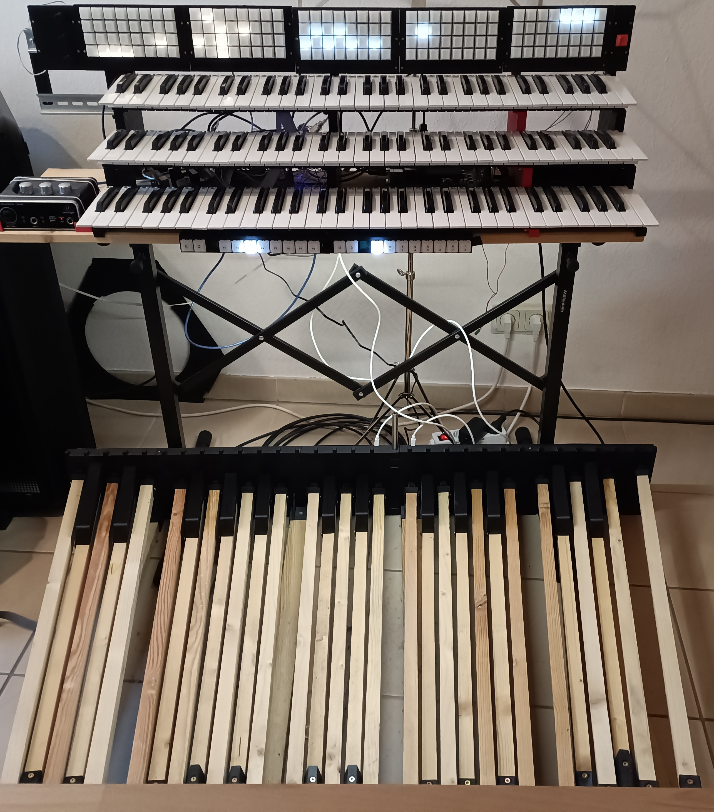

This a manual for building a portable electrical organ.
The manual can be found [here](./manual.md).
If you need help or can't source a specific part, create an issue or send an email.

# Goals
This project has a few goals in mind:
* Affordability: keep it around or below 1000€
* Transportability: a single person should be able to transport (and assemble) the organ in a small car.
* possible to build for a layman: while the assembly is not necessary easy or straightforward, there are no steps that require experience or precision.
* open source
* be adjacent to the BDO spec: The pedalboard layout roughly follows the BDO spec apart from some cost saving measures

# Future plans
* Add a manual for a bench
* Add a manual for a sheet stand
* Add parts for different wood sizes

# Contributing
Apart from contributing to the code you can suggest changes to the printed files or improve the manual.
In particular more images or better explanations for difficult steps would be nice.
